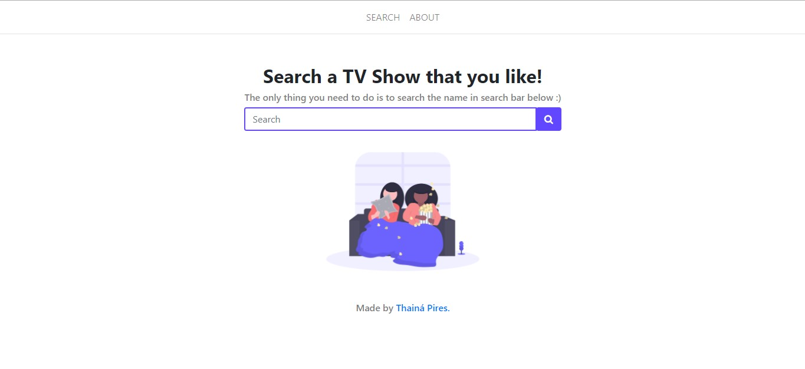

<h2 align="center">TV-shows Finder</h2>

  A Simple TV Shows finder that uses Flask and TVmaze API. I'm developing this for learning purpose.

   <!---->
   

# Preview

<kbd>
  
</kbd>

## Goals

- [x] Create base for the search and results page
- [x] Return all the results for the search term
- [ ] Add Pagination to return all the results in pages
- [ ] Fix the card design 
- [ ] Improve my CSS and HTML code
- [ ] Add Search Bar with the term searched in the results page
