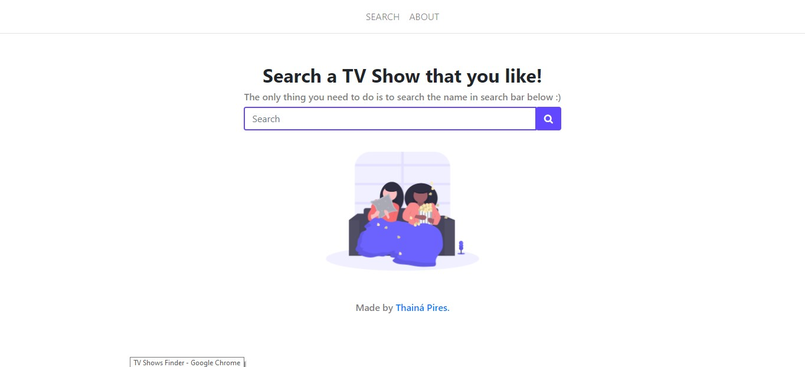

<h2 align="center">TV-shows Finder</h2>

  A Simple TV Shows finder that uses Flask and TVmaze API.

   <!---->
   

# Preview

  

## Goals

- [x] Create base for the search and results page ;)
- [ ] Return all the results for the search therm
- [ ] Add Pagination to return all the results in pages
- [ ] Fix the card design
